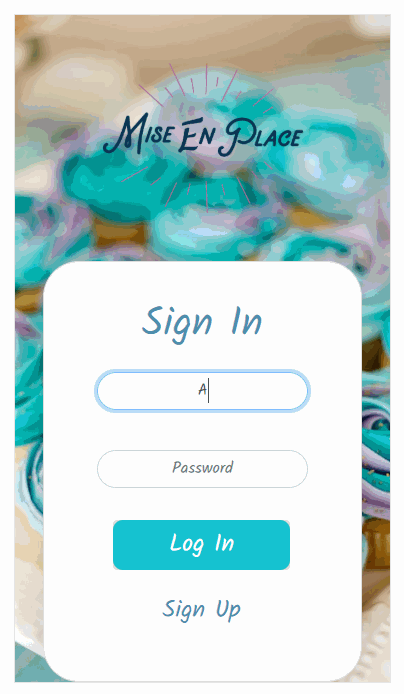

# recipe-manager

A web application for people who enjoy cooking and want to create and share personal recipes

## Technologies used

  * JavaScript
  * CSS3
  * Flexbox
  * Bootstrap
  * React
  * Node.js
  * Express
  * PostgreSQL
  * AWS EC2

## Preview

## Live Demo

[Checkout the site here:](https://miseenplace.alex-aranda.com/)

## Features
  * User can sign up and log in
  * User can create recipes
  * User can view created recipes
  * User can create a meal plan
  * User can generate a shopping list based on recipes in meal plan
  * User can see recipes from all users in a public page
  * User can view and public recipes
  * User can add public recipes to user recipes